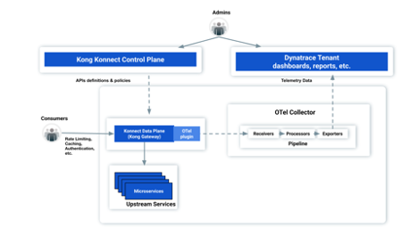
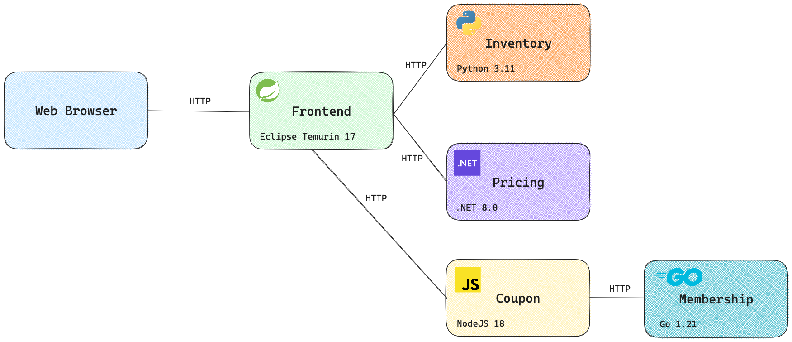

Kong is widely adopted API gateway and service mesh and provides cloud agnostic API gateway services to modern architecture. Not only does it provide load balancing but also allows user to use multiple plugins and policies to control the traffic. Implementing observability at the API gateway layer is crucial. As the API gateway serves as a central point for managing and routing traffic across distributed services, applying observability to it brings an enterprise-wide perspective on how applications are consumed.

This repo contains a sample app that shows the integration between Kong and Dynatrace. This integration uses OpenTelemetry for traces and logs and Prometheus for metrics. Using this integration, customers will be able to connect traces, metrics and logs in Dynatrace. At high level, the integration architecture looks like this:



# Simple eCommerce Demo Applications
This repository contains the code for the Simple eCommerce Demo Applications.
This application is a simple e-commerce application that allows users to purchase items from a catalog.

## Architecture



Simple Demo contains the following services:

| Service | Language | Version |
| --- | --- | --- |
| Frontend | Java | 17 (Eclipse Temurin) |
| Inventory | Python | 3.11 |
| Pricing | .NET | 8.0 |
| Membership | Go | 1.21 |
| Coupon | JavaScript | NodeJS 18.3.0 |

## Deployment
The demo app used here is deployed in K8s. To deploy the app, follow these steps. The Dynatrace API-Token must have these three permission:
1. Ingest Logs
2. Ingest Metrics
3. Opentelemetry traces

```
kubectl apply -f kong/clusterRole.yaml
kubectl apply -f kong/clusterRoleBinding.yaml
kubectl apply -f kong/eCommerceDeployment.yaml
kubectl create ns opentelemetry-operator-system
kubectl create secret generic dynatrace-endpoint -n opentelemetry-operator-system --from-literal=dt-endpoint='https://<tenantID>.live.dynatrace.com/api/v2/otlp'
kubectl create secret generic dynatrace-access-token -n opentelemetry-operator-system --from-literal=dt-access-token='dt0c01.XXXXX'
kubectl create namespace kong
helm repo add kong https://charts.konghq.com
helm repo update
kubectl create secret tls kong-cluster-cert -n kong --cert=kong/tls.crt --key=kong/tls.key
helm install kong kong/kong -n kong --values kong/values.yaml
kubectl apply -f kong/loadGenerator.yaml
kubectl create serviceaccount collector -n opentelemetry-operator-system
helm repo add jetstack https://charts.jetstack.io
helm repo update

helm install \
  cert-manager jetstack/cert-manager \
  --namespace cert-manager \
  --create-namespace \
  --version v1.16.2 \
  --set crds.enabled=true

helm repo add open-telemetry https://open-telemetry.github.io/opentelemetry-helm-charts

helm install opentelemetry-operator open-telemetry/opentelemetry-operator \
  --namespace opentelemetry-operator-system \
  --create-namespace \
  --set "manager.collectorImage.repository=otel/opentelemetry-collector-k8s" \
  --set admissionWebhooks.certManager.enabled=true

 kubectl apply -f kong/otelcollector-dynatrace-traces-metrics-logs.yaml
```

